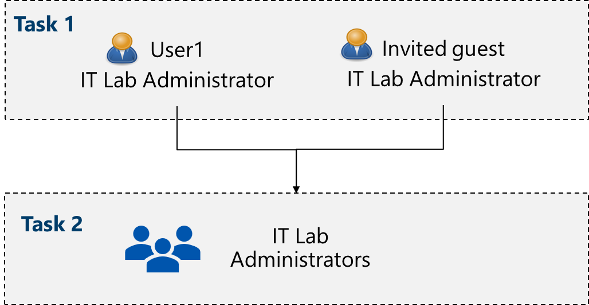
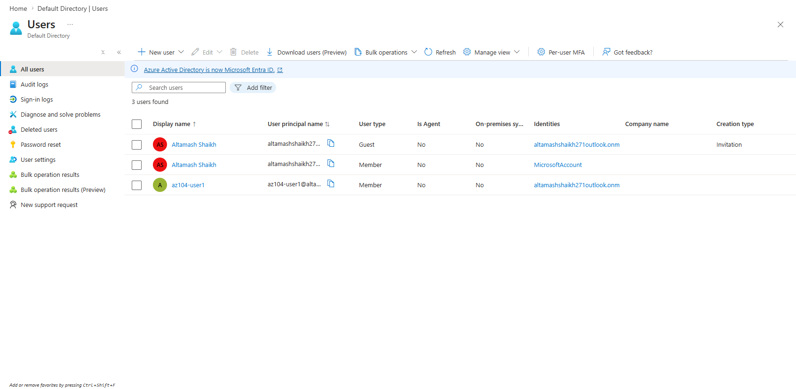
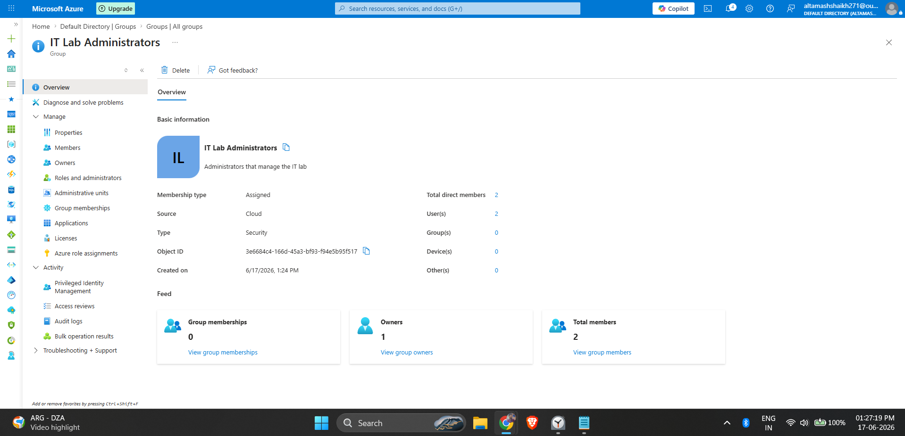
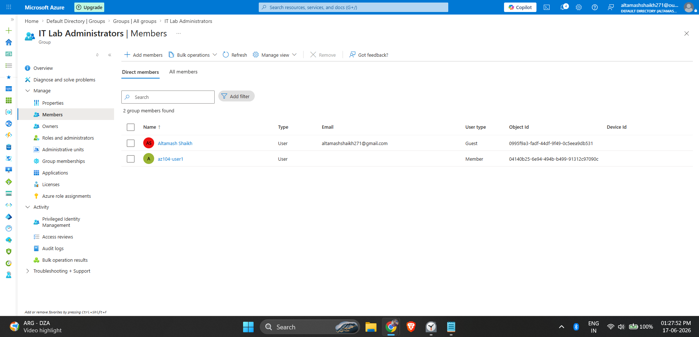

# Azure Identity Management: Microsoft Entra ID (AZ-104 Lab)

## Objective
The goal of this lab was to provision and manage cloud identities using **Microsoft Entra ID** (formerly Azure AD) for a new pre-production testing environment. This involved creating internal user accounts, inviting external guest users, and configuring a security group to minimize administrative overhead.

## Skills Demonstrated
- **Identity Provisioning:** Created internal cloud-native users and managed Azure B2B guest invitations.
- **Access Management:** Configured Azure Security Groups for role-based testing.
- **Security Best Practices:** Applied principle of least privilege and validated user properties.

## Architecture 

## Step-by-Step Configuration

### 1. Provisioning User Accounts
I navigated to the Microsoft Entra ID admin center and created a cloud-native user (`az104-user1`) assigned to the "IT" department as an "IT Lab Administrator". Following this, I simulated a B2B collaboration scenario by inviting an external user via email to join the directory.

*Both the cloud-native user and the external guest user successfully provisioned in the directory.*

### 2. Configuring Security Groups
To manage access efficiently, I created a new Security Group named **IT Lab Administrators**. 

*Security Group configured to manage lab access.*

### 3. Assigning Members
Instead of assigning permissions to users individually, I added both the internal user and the guest user to the newly created Security Group. In a production environment, this allows for streamlined Role-Based Access Control (RBAC) assignments at the group level.

*Users successfully added to the security group.*

## Key Takeaways
- Entra ID allows for seamless collaboration with external vendors through Guest User invitations.
- Grouping users by department or role (like IT Lab Administrators) is critical for scaling access control without increasing administrative overhead.